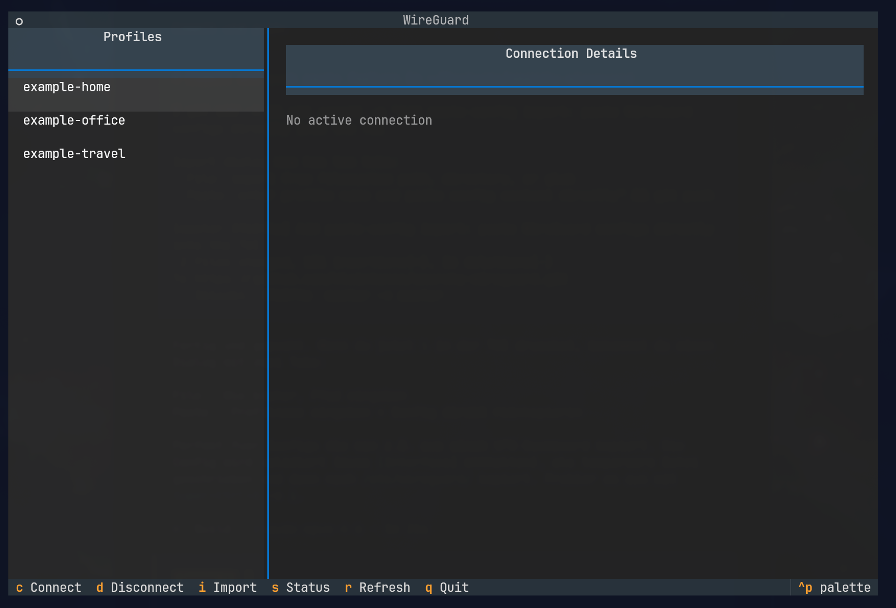
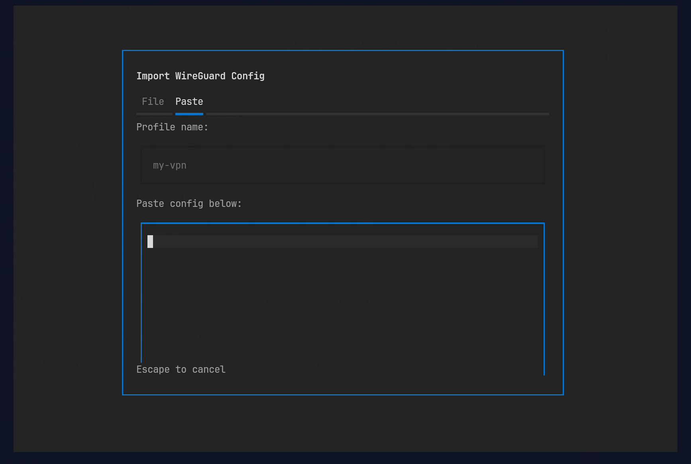

# WireGuard TUI for Omarchy

A terminal user interface for managing WireGuard VPN connections on [Omarchy](https://github.com/nichochar/omarchy). Built with [Textual](https://github.com/Textualize/textual), integrates natively with Omarchy's keybindings and launcher system.

## Screenshots





## Features

- Browse and switch between WireGuard profiles
- Auto-detects configs from `/etc/wireguard/`
- Live connection status with endpoint, handshake, and transfer stats
- Auto-refresh every 2 seconds
- Passwordless operation (no sudo prompts)
- Hyprland keybinding (`Super+Ctrl+G`)
- Single-instance window management (like Omarchy's Wi-Fi TUI)

## Prerequisites

- [Omarchy](https://github.com/nichochar/omarchy) installed and running
- WireGuard `.conf` files in `/etc/wireguard/`

## Install

```bash
git clone https://github.com/kleintonno/omarchy-wireguard.git
cd omarchy-wireguard
./install.sh
```

The installer handles everything:
- Installs `wireguard-tools` and `python-textual` if missing
- Copies the TUI scripts to `~/.local/share/omarchy/bin/`
- Sets up passwordless sudo for `wg` and `wg-quick`
- Adds the `Super+Ctrl+G` keybinding
- Reloads Hyprland

## Uninstall

```bash
./uninstall.sh
```

## Usage

Press `Super+Ctrl+G` or run from terminal:

```bash
omarchy-wireguard
```

### Keybindings

| Key | Action |
|-----|--------|
| `c` | Connect to selected profile |
| `d` | Disconnect active tunnel |
| `i` | Import config file |
| `s` | Refresh status |
| `r` | Refresh profile list |
| `q` | Quit |
| `Enter` | Quick connect |

## Adding VPN Profiles

Press `i` inside the TUI to open the import dialog with two tabs:

**File tab** - Import from filesystem:
- A single file: `~/Downloads/my-vpn.conf`
- A directory: `~/Downloads/vpn-configs/` (imports all `.conf` files)
- A glob pattern: `~/Downloads/*.conf`

**Paste tab** - Paste config directly:
1. Enter a profile name (e.g. `my-vpn`)
2. Paste the full WireGuard config into the text area
3. Click Save

Or import manually from the command line:

```bash
sudo cp your-vpn.conf /etc/wireguard/
sudo chmod 600 /etc/wireguard/your-vpn.conf
```

The TUI picks up new profiles automatically.

## License

MIT
